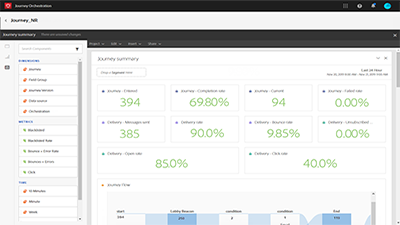

# Journey Orchestration チュートリアル

[!UICONTROL Journey Orchestration] は、Adobe Experience Platform と統合されたアプリケーションサービスです。これを利用すると、イベントやデータソースに格納されているコンテキストデータを使用して、リアルタイムオーケストレーションのユースケースを実現できます。

## 最新情報

* **[「プロファイルを更新」アクション](/help/building-a-journey/update-profile-action.md)**
* **[別のジャーニーへのジャンプ](/help/building-a-journey/jumping-to-another-journey.md)**
    
   *個人をあるジャーニーから別のジャーニーに移動させる方法を説明します。*

## スタッフのおすすめ

<table>
<tr>
  <td>
    
    

      <a href="./understanding-journey-orchestration.md">
    <strong>Journey Orchestration について</strong>
    </a>
    

    

    <em>Journey Orchestration の概念、Journey Orchestration によって実現できるユースケースのタイプおよび Journey Orchestration の主な要素の仕組みを理解します。</em>
    

  </td>
  <td>
    
    

      <a href="./building-a-journey/creating-a-journey.md">
    <strong>ジャーニーの作成（ビデオ）</strong>
    </a>
    

    

    <em>ジャーニーの作成方法、イベントの開始方法、オーケストレーションを使用したジャーニーのフローとタイミングの制御方法、ジャーニーの各ポイントでのアクションを使用したエンゲージメント方法について説明します。</em>
    

  </td>
  <td>
   
    

      <a href="./analyze-a-journey-via-reporting-tools.md">
    <strong>レポートツールを使用したジャーニーの分析</strong>
    </a>
    

    

    <em>ジャーニーのレポートに移動する方法、レポートの日付範囲をカスタマイズする方法、後で使用するためにレポートテンプレートを保存する方法について説明します。</em>
    

  </td>
</tr>
</table>

## その他のリソース

* [Journey Orchestration ヘルプセンター](https://experienceleague.adobe.com/docs/journeys/using/journey-orchestration-home.html?lang=ja)
* [Adobe Experience Platform のチュートリアル](https://experienceleague.adobe.com/docs/platform-learn/tutorials/overview.html?lang=ja)
